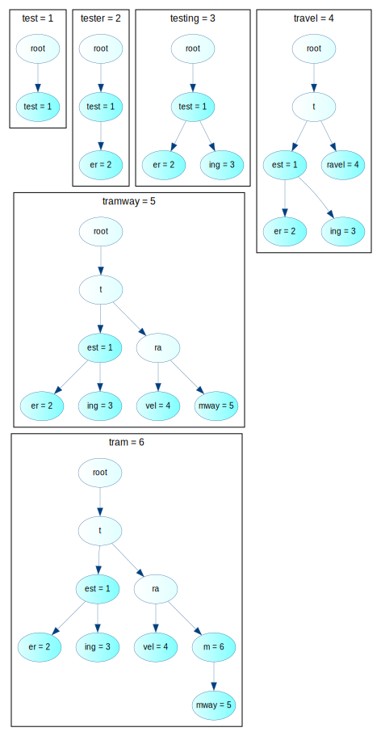
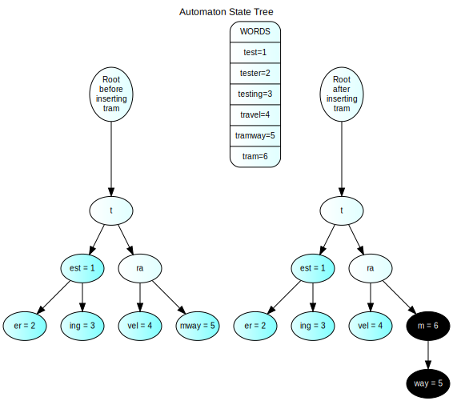

# Automaton state module reference

## State structure

The state is represented as a radix tree based on all the key/value pairs in it.

### State transitions

Here is an example of adding the following key/value pairs one by one:

```
test=1
tester=2
testing=3
travel=4
tramway=5
tram=6
```




Here is an example of the tree before and after setting the value of `tram` to `6`:



## state interface

**state.h**

```cpp
class state {
 public:
  // Get the value at given path. Empty string if no value is set or
  // there is no node at the given path
  string get(string key) = 0;

  // Set the value at a given path
  void set(string key, string value) = 0;

  // Get the hash of a node at the given path. Empty string if no value is
  // set or there is no node at the given path
  string get_node_hash(string path) = 0;

  // Get the children as string
  vector<string> get_node_children(string path) = 0;

  // delete subtree with root the node at the given path
  void delete_node_tree(string path) = 0;

  // finalizes the changes made by set
  void commit() = 0;

  // discards the changes made by set;
  void abort() = 0;
}
```

## Examples:

### Get value
```cpp
get("a");
// -> ""
set("abc", "123");
get("ab")
// -> ""
get("abc", "123");
// -> "123"
```

### Get hash
```cpp
get_node_hash("");
// -> ""
set("abc", "123");
get_node_hash("");
// -> "hash of root"
get_node_hash("a");
// -> "hash of node a"
get_node_hash("abc");
// -> "hash of node abc"
```

### Get children
```cpp
set("abc", "1");
set("acc", "2");
set("ccc", "3");
vector<string> children = get_node_children("");
// children contains:
// ->{"a", "c"}
children = get_node_children("a");
// children contains:
// ->{"b", "c"}
children = get_node_children("ab");
// children contains:
// ->{"c"}
children = get_node_children("ccc");
// children contains:
// ->{""}
```

### delete_node_tree
```cpp
set("abc", "1");
set("acc", "2");
set("acd", "3");
delete_node_tree("ac");
// -> element acc, acd and ac are deleted;
delete_node_tree("abc");
// -> element abb gets deleted, the tree contains no nodes.
```


### commit and abort
```cpp
set("ab", "1");
get("ab");
// -> "1"
commit();
set("cd", "2");
get("ab");
// -> "1"
get("cd")
// -> "2"
abort();
get("ab");
// -> "1"
get("cd")
// -> ""
// Changed made after commit() was called are
// discarded when abort is called
delete_node_tree("ab");
get("ab");
// -> ""
abort();
get("ab");
// -> "1"
```

### Sample implementation

```cpp
#include <algorithm>
#include <bitset>
#include <iostream>
#include <set>
#include <string>
#include <thread>
#include <type_traits>
#include <typeinfo>
#include <tuple>
#include <utility>
#include <vector>
#include <ctime>
#include <random>
#include <iomanip>
#include <sstream>

using namespace std;

class state {
public:
  // Get the value at given path. Empty string if no value is set or
  // there is no node at the given path
  virtual string get(string key) = 0;

  // Set the value at a given path
  virtual void set(string key, string value) = 0;

  // Get the hash of a node at the given path. Empty string if no value is
  // set or there is no node at the given path
  virtual string get_node_hash(string path) = 0;

  // Get the children as string
  virtual vector<string> get_node_children(string path) = 0;

  // delete subtree with root the node at the given path
  virtual void delete_node_tree(string path) = 0;

  // finalizes the changes made by set
  virtual void commit_changes() = 0;

  // discards the changes made by set;
  virtual void discard_changes() = 0;
};

// http://coliru.stacked-crooked.com/a/8074d8fbed5b8365

template<int CHILDREN>
class radix_tree_state : public state {

  struct node {
    string hash;
    string value;
    unsigned long children[CHILDREN];
  };

  vector<node> nodes;

  int ensure_path(string path) {
    unsigned long cur = 0;

    for (const uint8_t& c : path) {
      node& n = nodes[cur];
      if (n.children[c] == 0) {
        n.children[c] = nodes.size();
        nodes.push_back(node());
      }
      try {
        cur = n.children[c];
      } catch(...) {
        cout << "Exception!" << endl;
      }
    }

    return cur;
  }

public:

  radix_tree_state() {
    nodes.push_back(node());
  }

  virtual string get(string key) {
    return "";
  }

  virtual void set(string key, string value) {
    int key_node_index = ensure_path(key);
    nodes[key_node_index].value = value;
  }

  virtual string get_node_hash(string path) {
    return "";
  }

  virtual vector<string> get_node_children(string path) {
    vector<string> result;
    return result;
  }

  virtual void delete_node_tree(string path) {

  }

  virtual void commit_changes() {

  }

  virtual void discard_changes() {

  }
};

std::random_device rand_engine;

const uint32_t TEST_KEYS_NUMBER = 100000;


int main()
{
  string hash;
  uint32_t x;
  radix_tree_state<256> s;

  for (int i = 0; i < TEST_KEYS_NUMBER; i++) {
    x = rand_engine();
    hash = string((const char *)&x, sizeof(x));
    x = rand_engine();
    hash.append((const char *)&x, sizeof(x));
    x = rand_engine();
    hash.append((const char *)&x, sizeof(x));
    x = rand_engine();
    hash.append((const char *)&x, sizeof(x));

    if (i % 10 == 0) {
      cout << "adding " << io::bin2hex(hash) << endl;
    }
    s.set(hash, hash);

    // std::cout << std::hex << std::setw(8) << std::setfill('0') << x;
  }

  cout << io::bin2hex(hash) << endl;

  cout << "done." << endl;
  return 0;
}
```
